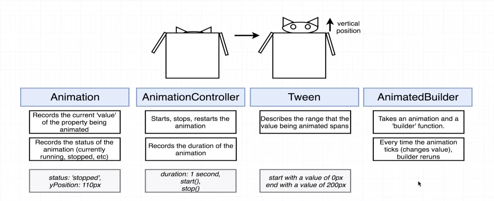

# Animation Notes
Tuesday, July 9, 2019


## Four Key Classes

1.  __Animation__

    +   Records the current 'value' of the property being animated

    +   Records status of animation (running, stopped, etc.)

    +   Ex) vertical position of cat

        - Properties:
            -   status: 'stopped'
            -   yPosition: 110px

2.  __AnimationController__

    +   Responsible for starting, stopping, and restarting the animation

    +   Changes state of animation

    +   Records the duration of the animation

    +   Ex) current state of cat animation

        - Properties:
            -   duration: 1 sec
            -   start()
            -   stop()


3.  __Tween__

    +   Short for inbetween - how a range of values of animation are changing

    +   Ex) location of cat

        -  Properties:
            - starting value of 0px
            - ending value of 200px


4.  __AnimatedBuilder__

    +   Takes an animation and a 'builder' function

    +   Every time the animation 'ticks' (changes value), the builder function is re-run and updates some widget on the device

    +   Very similar to StreamBuilder




---

## Widget Structure (Lec. 182)
+   Create a helper method called buildAnimation() that will be used to build Animation widgets, instead of having nested Animations that are confusing to read


## Declaring with TickerProvider (Lec. 185)

+   Gives us a notification any time our Animation needs to update

+   Something needs to reach into _HomeState catController and tell it 

+   Handle from outside world into our widget - allows us to render the next frame in the automation

+   TickerProvider is a mixin - 


## Tweens with Curves (Lec. 186)

+   Cat's position is the value that is being animated

+   Over time, move cat up from 0px to 100px

+   CurvedAnimation - rate at which Tween will change over time.  Curved animations usually provide better, more natural, animations, than linear.

+   Tween is created one time, no need to define to an instance variable


## Performance Savings with AnimatedBuilder (Lec. 187)

+   The child - we may want to create a widget and only want to change one aspect about it over time.  Don't want to have to re-render and display a new widget each time.

+   This animation will attempt to change 60 times / sec.

+   Don't want to try and recreate a Widget over and over again

+   So inside builder, only make one small change

+   For child: the one instance of Cat() will be used again and agains

````dart
    Widget buildAnimation() {
        return AnimatedBuilder(
            animation: catAnimation,
            builder: (context, child) {},
            child: Cat(),
        );
    }
````

## Nature of Animation

+   Only way to change layout of Widgets on screen is to create a new Widget

+   Here, we only create the Cat() instance once, but we repeat the Container class repeatedly

+   Will move Cat by changing the margin around the cat

+   What property are you going to change over time?