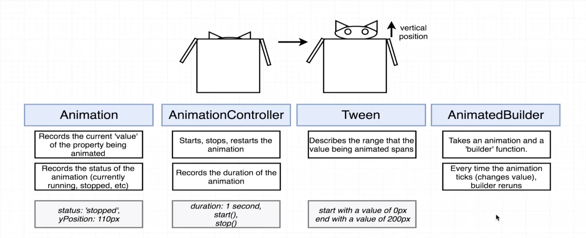
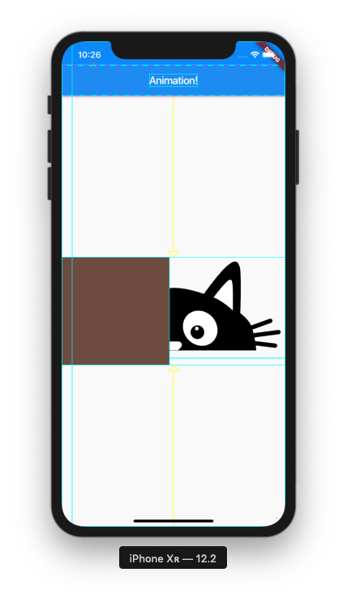
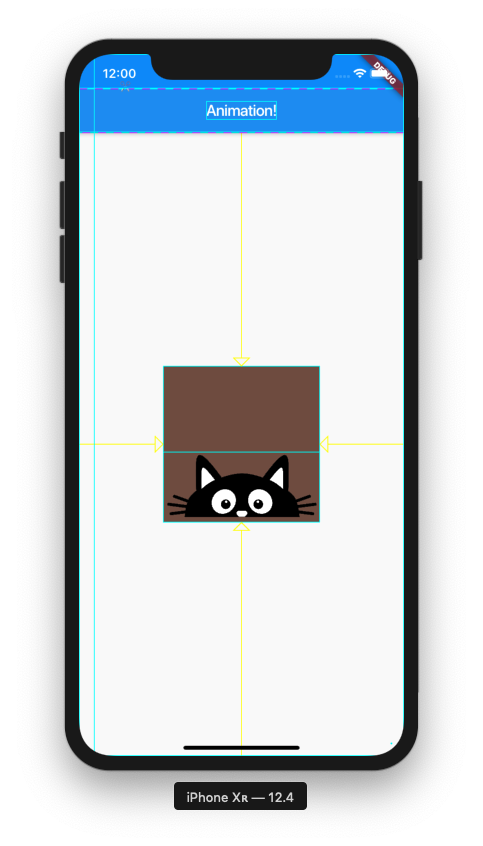

# Animation Notes
Tuesday, July 9, 2019


## Four Key Classes

1.  __[Animation](https://api.flutter.dev/flutter/animation/Animation-class.html)__

    +   Records the current 'value' of the property being animated

    +   Records status of animation (running, stopped, etc.)

    +   Ex) vertical position of cat

        - Properties:
            -   status: 'stopped'
            -   yPosition: 110px

2.  __[AnimationController](https://api.flutter.dev/flutter/animation/AnimationController-class.html)__

    +   Responsible for starting, stopping, and restarting the animation

    +   Changes state of animation

    +   Records the duration of the animation

    +   Ex) current state of cat animation

        - Properties:
            -   duration: 1 sec
            -   start()
            -   stop()


3.  __[Tween](https://api.flutter.dev/flutter/animation/Tween-class.html)__

    +   Short for inbetween - how a range of values of animation are changing

    +   Ex) location of cat

        -  Properties:
            - starting value of 0px
            - ending value of 200px


4.  __[AnimatedBuilder](https://api.flutter.dev/flutter/widgets/AnimatedBuilder-class.html)__

    +   Takes an animation and a 'builder' function

    +   Every time the animation 'ticks' (changes value), the builder function is re-run and updates some widget on the device

    +   Very similar to StreamBuilder


This chart outlines the four animation classes:



---

## Widget Structure (Lec. 182)
+   Create a helper method called buildAnimation() that will be used to build Animation widgets, instead of having nested Animations that are confusing to read


## Declaring with TickerProvider (Lec. 185)

+   Gives us a notification any time our Animation needs to update

+   Something needs to reach into _HomeState catController and tell it 

+   Handle from outside world into our widget - allows us to render the next frame in the automation

+   TickerProvider is a mixin - 


## Tweens with Curves (Lec. 186)

+   Cat's position is the value that is being animated

+   Over time, move cat up from 0px to 100px

+   CurvedAnimation - rate at which Tween will change over time.  Curved animations usually provide better, more natural, animations, than linear.

+   Tween is created one time, no need to define an instance variable


## Performance Savings with AnimatedBuilder (Lec. 187)

+   The child - we may want to create a widget and only want to change one aspect about it over time.  Don't want to have to re-render and display a new widget each time.

+   This animation will attempt to change 60 times / sec.

+   Don't want to try and recreate a Widget over and over again

+   So inside builder, only make one small change

+   For child: the one instance of Cat() will be used again and again

````dart
    Widget buildAnimation() {
        return AnimatedBuilder(
            animation: catAnimation,
            builder: (context, child) {},
            child: Cat(),
        );
    }
````

## Nature of Animation

+   Only way to change layout of Widgets on screen is to create a new Widget

+   Here, we only create the Cat() instance once, but we repeat the Container class repeatedly

+   Will move Cat by changing the margin around the cat

+   What property are you going to change over time?


## Building a Box Using Container

+   [Container](https://api.flutter.dev/flutter/widgets/Container-class.html)


## Layouts with the Stack Widget (Lec. 193, 194)

+   [Stack](https://api.flutter.dev/flutter/widgets/Stack-class.html)

+   The Cat body doesn't obey the rules of Column or Row

+   _Layout Widgets_

    +   Column - attempts to layout list of widgets in a column

    +   Row - layout a list of widgets in a row

    +   Stack - render widgets on top of each other; we can position these widgets relative to each other

##  Order of Drawing Widgets on Stack

```dart 
     child: Stack(
        children: <Widget>[
            Widget1,
            Widget2,
            Widget3
        ],
``` 
+   Widget1 is first, so it's at the bottom of the stack.  Widget3 is last, so it's on the top.

## Center a Widget (Lec. 195)

+   [Center](https://api.flutter.dev/flutter/widgets/Center-class.html)

+   Centers its child within itself.  Center widget expands to fill entire space.  Takes a single child and tries to fill the entire space.

+   Added a Center widget to wrap the Stack of animation


## Positioned Widgets (Lec. 196)

+   [Stack](https://api.flutter.dev/flutter/widgets/Stack-class.html) provides the layout rules for Cat and Box, not the Center widget:

    +   Each child of a Stack widget is either positioned or non-positioned

    +   By default, Stack elements are non-positioned

    +   Stack sizes itself to contain all non-positioned children

    +   By default, widgets positioned according to alignment in the top-left corner 

+   Add a debug rendering statement in `main.dart` to see widget boundaries:

```dart
    import 'package:flutter/rendering.dart';

    void main() {
        debugPaintSizeEnabled = true;
        runApp(App());
    }
```

+   The Stack boundary lines in debug mode:

    


## Expanding Stack Dimensions (Lec. 197)

+   To get center alignment correct for Cat and Box, will change Cat layout only

+   Changing margin of Container to move Cat - big downside when using Stack widget

+   But as the Cat moves, the margin increases and the Box continues to stay pinned to the upper left corner of the Stack

+   Key - don't change dimensions of Stack, because that will change everything in the Stack

+   TODO - change Cat from non-positioned to positioned.  The Stack will then ignore

+   [Positioned](https://api.flutter.dev/flutter/widgets/Positioned-class.html) - a Widget container specifically for the Stack class

```dart
    Widget buildCatAnimation() {
      return AnimatedBuilder(
        animation: catAnimation,
        builder: (context, child) {
          return Positioned(
            child: child,
            bottom: catAnimation.value,
          );
        },
        child: Cat(),
      );
    }
```

## Three Reasons for Strange Layouts (Lec. 198)

+   When using a `Positioned` widget, the Stack ignores that widget when it does its sizing

+   Three Strange Things

    1.  See bottom-left corner of Cat image - offset to 0.0 on bottom left
        - bottom property - tries to match to bottom edge of Stack

    2.  Why Cat image is so large - image expands to its container extents

    3.  Why do we only see the whiskers?
        - Image extends beyond bounds of Stack
        - Stack clips anything outside of its own extend


## Positioned Constraints (Lec. 199)

+   To fix then Positioned widget, add `right` and `left` constraints:

    +   right - 0.0 pixel offset - match up with right-hand edge of Stack
    
    +   left - 0.0 pixel offset

+   Adding left and right constraints will shrink the Positioned element to the size of the Stack

+   With the three Positioned constraints of bottom, right, and left, the Positioned element will only fill up the size of the Stack.  This will shrink the size of the Image to the size of the Positioned element.

    ```dart
    Widget buildCatAnimation() {
      return AnimatedBuilder(
        animation: catAnimation,
        builder: (context, child) {
            return Positioned(
                child: child,
                top: catAnimation.value,
                right: 0.0,
                left: 0.0
            );
        },
        child: Cat(),
      );
    }
    ```

+   How the Cat displays with the additional `right` and `left` constraints:

    


## Negative Offsets (Lec. 200)

+   Used a negative offset to reposition the Cat's ears to appear outside of the Stack

```dart
    catAnimation = Tween(begin: -50.0, end: -50.0).animate(CurvedAnimation(
      parent: catController,
      curve: Curves.easeIn,
    ));

```

## Stack Clip Settings

+   Add Stack property to allow for widget to extend beyond Stack

    ```dart
    child: Stack(
        children: <Widget>[
            buildBox(),
            buildCatAnimation(),
        ],
        overflow: Overflow.visible
    )
    ```

## Adjust Tween Ranges (Lec. 202)

+   Adjust tween ranges for Cat head to pop up

+   Decrease catController duration from 2 seconds to 300 milliseconds to make the animation more realistic:

    ```dart
    catController = AnimationController(
      duration: Duration(milliseconds: 300),
      vsync: this,
    );
    ```